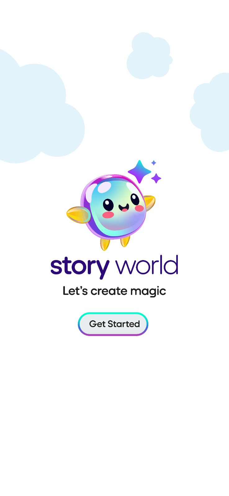
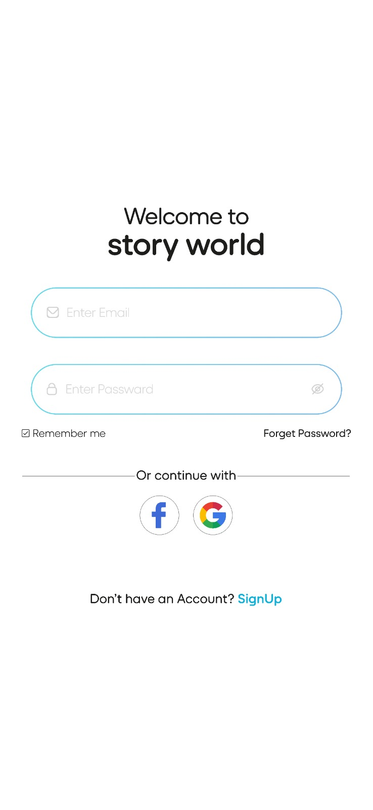
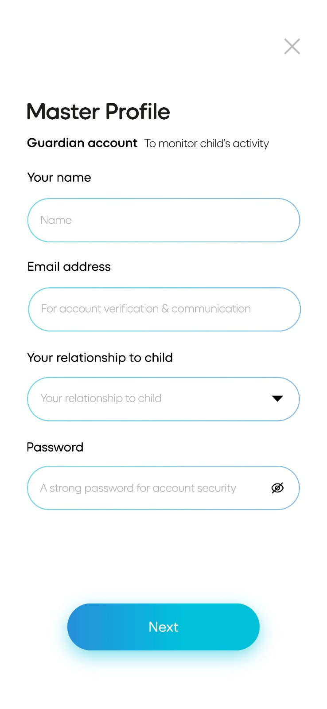
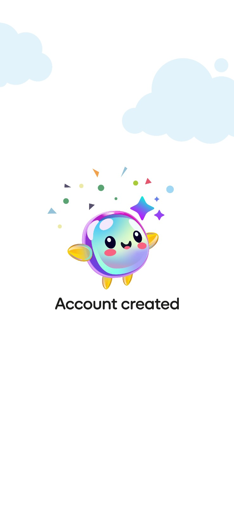
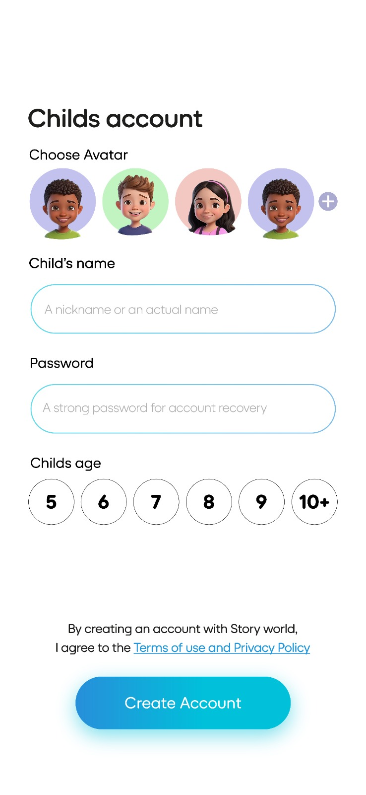
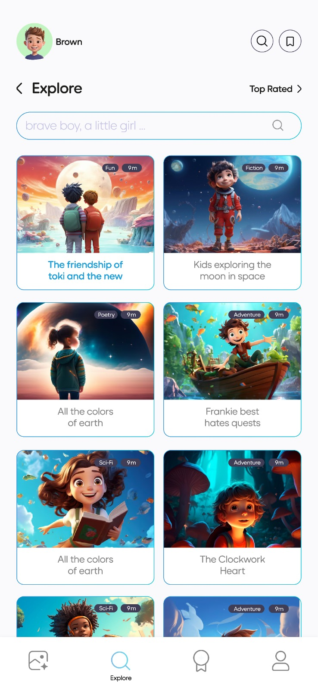
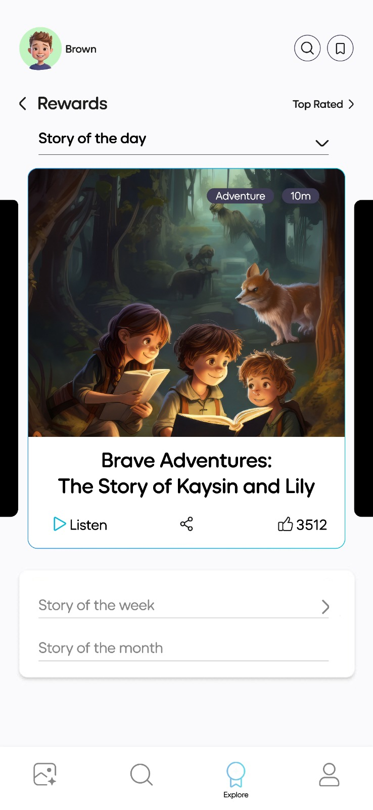
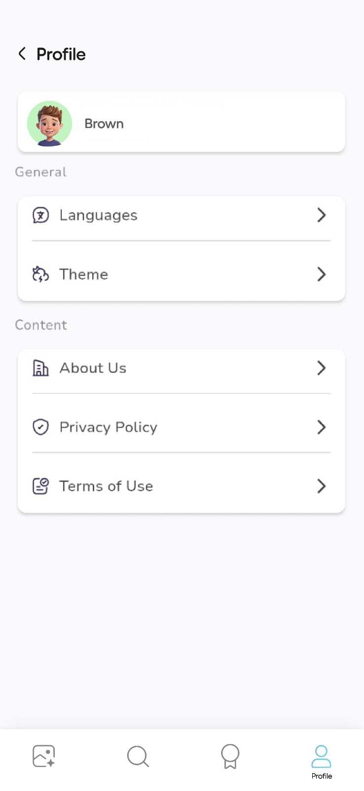

# Story World

## Mock screens

| Screens                                                                                       | Queries                                                                                                                                                                                                                                                                                                          |
  | --------------------------------------------------------------------------------------------- | ---------------------------------------------------------------------------------------------------------------------------------------------------------------------------------------------------------------------------------------------------------------------------------------------------------------- |
  |  | If the user has already signed in, can this screen be skipped and a show a loading screen instead?                                                                                                                                                                                                               |
  |  | Sign-in button is missing.                                                                                                                                                                                                                                                                                       |
  |  | Is this screen meant for creating a new user by clicking the SignUp link from the Login screen? If so, do we really need this as everyone must be having either **Google** or **Facebook** account.<br><br>If the above point is agreed, should we add **Apple** account for logging in?                         |
  |  | Should we add a link to create child account in screen 3?                                                                                                                                                                                                                                                        |
  |  | Both parents and kids will have different login screens?                                                                                                                                                                                                                                                         |
  |  | Are the buttons in the top right corner required as we already have them at the bottom?                                                                                                                                                                                                                          |
  |  | Why is this screen titled as **Rewards**?<br>Should the voice be of a kid when clicking on the **Listen** button? Also consider male/female voice.                                                                                                                                                               |
  |  | What is **Language** option for? For generating story? If so, can this option also be added while creating the user?<br>What is **Theme** option for?<br>What should happen when the user clicks on **About us** link?<br>Content is required for **Privacy Policy** and **Term of Use**. Action on **Vignesh**. |

## Other queries

- Sign out option is missing. Is it required if a user wants to sign in with a different account?
- Can parents create more than one child accounts? If so, mock screen has to be updated accordingly.
- Should guardian view/monitor child's activities or stories created by the child? If agreed, a separate screen is required.
- Can a story be deleted?
- How are we going to pick story of the day/week/month? By just clicking on the **Like** option? In that case, how to handle if more than one stories have same number of likes?
- Should we consider about Landscape mode as we will be supporting multiple form factors (Phones, Tablets & Foldable devices)?

## Dependencies

- Latest Android device required for testing.
- iPhone is required for testing. **Senthil** to check, if testing can be done simulator in Windows/Linux.
- **Deena** to share Wi-Fi password for setting up Android Emulator.
- OpenAI always throws error when invoking the API. Below is the error messages:

  ```json
  error: {
    message: 'You exceeded your current quota, please check your plan and billing details. For more information on this error, read the docs: https://platform.openai.com/docs/guides/error-codes/api-errors.',
    type: 'insufficient_quota',
    param: null,
    code: 'insufficient_quota'
  }
  ```

## Others

- Can I utilize Yokesh or Hari for UI development to expedite the project?
